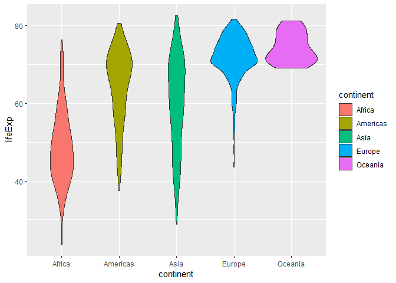
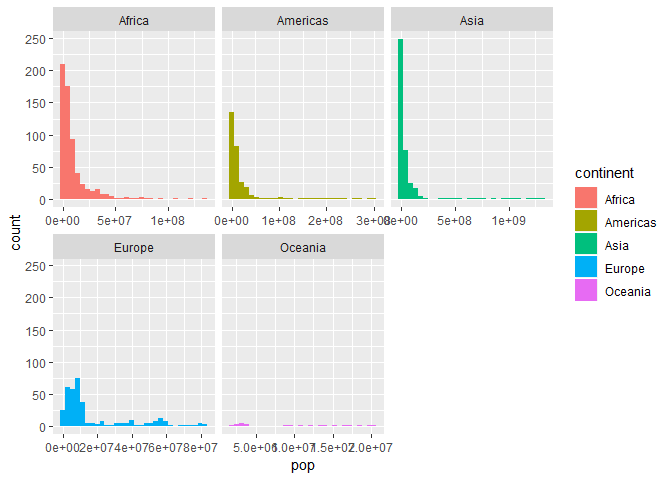
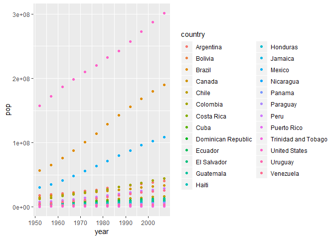

gapminder\_exploration
================

Bring the rectangular data in
-----------------------------

``` r
library(gapminder)
library(tidyverse)
```

    ## -- Attaching packages ------------------------------------------------------------ tidyverse 1.2.1 --

    ## √ ggplot2 3.0.0     √ purrr   0.2.5
    ## √ tibble  1.4.2     √ dplyr   0.7.6
    ## √ tidyr   0.8.1     √ stringr 1.3.1
    ## √ readr   1.1.1     √ forcats 0.3.0

    ## -- Conflicts --------------------------------------------------------------- tidyverse_conflicts() --
    ## x dplyr::filter() masks stats::filter()
    ## x dplyr::lag()    masks stats::lag()

Small test the data
-------------------

1.  Is it a data.frame, a matrix,a vector, a list? Answer: As we called the str() function, we can clearly see that our data is a data.frame.

``` r
str(gapminder)
```

    ## Classes 'tbl_df', 'tbl' and 'data.frame':    1704 obs. of  6 variables:
    ##  $ country  : Factor w/ 142 levels "Afghanistan",..: 1 1 1 1 1 1 1 1 1 1 ...
    ##  $ continent: Factor w/ 5 levels "Africa","Americas",..: 3 3 3 3 3 3 3 3 3 3 ...
    ##  $ year     : int  1952 1957 1962 1967 1972 1977 1982 1987 1992 1997 ...
    ##  $ lifeExp  : num  28.8 30.3 32 34 36.1 ...
    ##  $ pop      : int  8425333 9240934 10267083 11537966 13079460 14880372 12881816 13867957 16317921 22227415 ...
    ##  $ gdpPercap: num  779 821 853 836 740 ...

``` r
typeof(gapminder)
```

    ## [1] "list"

1.  What is its class? As shown below, the class() function returned the class of the data, which are table, tibble and data frame.

``` r
class(gapminder) ##class
```

    ## [1] "tbl_df"     "tbl"        "data.frame"

1.  How many variables/column? There are 6 columns when each column corresponding to one variable.

``` r
ncol(gapminder) ## number of column
```

    ## [1] 6

1.  How mant rows/observation? There are total 1704 rows which stands for 1704 observations.

``` r
nrow(gapminder)
```

    ## [1] 1704

1.  Get these facts about extent or size in more than one way?

``` r
length(gapminder) ## return the length of the vectors therefore the number of column
```

    ## [1] 6

``` r
dim(gapminder)  ## return the dimension of the vector in the format of row by column, therefore, 1704 rows and 6 column for this database
```

    ## [1] 1704    6

``` r
nrow <- dim(gapminder)[1] ## return number of rows
ncol <- dim(gapminder)[2] ## return number of columns
```

6.What data type is each variable?

|variable| data type|
---------------------

|--------|----------| | country | integer | | gdpPercap | double | | continent | integer | | year | integr | | pop | integer | | lifeExp | double |

``` r
typeof(gapminder$country)
```

    ## [1] "integer"

``` r
typeof(gapminder$gdpPercap)
```

    ## [1] "double"

``` r
typeof(gapminder$continent)
```

    ## [1] "integer"

``` r
typeof(gapminder$year)
```

    ## [1] "integer"

``` r
typeof(gapminder$pop)
```

    ## [1] "integer"

``` r
typeof(gapminder$lifeExp)
```

    ## [1] "double"

Exploring individual varaibles
------------------------------

Categorical variable:continent Quantitative variable:year

``` r
summary(gapminder)
```

    ##         country        continent        year         lifeExp     
    ##  Afghanistan:  12   Africa  :624   Min.   :1952   Min.   :23.60  
    ##  Albania    :  12   Americas:300   1st Qu.:1966   1st Qu.:48.20  
    ##  Algeria    :  12   Asia    :396   Median :1980   Median :60.71  
    ##  Angola     :  12   Europe  :360   Mean   :1980   Mean   :59.47  
    ##  Argentina  :  12   Oceania : 24   3rd Qu.:1993   3rd Qu.:70.85  
    ##  Australia  :  12                  Max.   :2007   Max.   :82.60  
    ##  (Other)    :1632                                                
    ##       pop              gdpPercap       
    ##  Min.   :6.001e+04   Min.   :   241.2  
    ##  1st Qu.:2.794e+06   1st Qu.:  1202.1  
    ##  Median :7.024e+06   Median :  3531.8  
    ##  Mean   :2.960e+07   Mean   :  7215.3  
    ##  3rd Qu.:1.959e+07   3rd Qu.:  9325.5  
    ##  Max.   :1.319e+09   Max.   :113523.1  
    ## 

``` r
summary(gapminder$continent) ##sorting the possible continent and also the number of country each continent contains
```

    ##   Africa Americas     Asia   Europe  Oceania 
    ##      624      300      396      360       24

``` r
max(gapminder$year)
```

    ## [1] 2007

``` r
min(gapminder$year)
```

    ## [1] 1952

``` r
var(gapminder$year)
```

    ## [1] 298.0916

As we can explore from the summary, for variable Continent, the possible values are Africa, Americas, Asia, Europe and Oceania. As for the quantitative variable year, the range of variable is from 1952 to 2007.

``` r
summary(gapminder$year)
```

    ##    Min. 1st Qu.  Median    Mean 3rd Qu.    Max. 
    ##    1952    1966    1980    1980    1993    2007

As shown from the above data, although year is ranging from 1952-2007, the most typical values are ranging from 1966 to 1993 with a median and mean of 1980.t The variance of this variable is 298.0916.

For the variable continent, the most typical value is Africa and the continent Oceania has less entries.

Explore various plot types
--------------------------

This is the scatterplot of pop vs gdpPercap

``` r
ggplot(gapminder,aes(pop,gdpPercap))+
  geom_point(alpha=0.25)
```


This is a histogram of pop and the bin is set to be 50.

``` r
ggplot(gapminder,aes(pop))+
  geom_histogram(bins=50)
```

 This is a combination of kernel density plot and histogram of pop and the bin is set to be 50.

``` r
ggplot(gapminder,aes(pop))+
  geom_histogram(aes(y=..density..))+
  geom_density()
```

    ## `stat_bin()` using `bins = 30`. Pick better value with `binwidth`.

 This is a boxplot of lifeExp for each continent.

``` r
ggplot(gapminder,aes(continent,lifeExp))+
  geom_boxplot()
```


This is the violin plot of lifeExp for each continent

``` r
ggplot(gapminder,aes(continent,lifeExp))+
  geom_violin()
```



Using filter(), select() and %&gt;%
-----------------------------------

filter the data to continent Oceania only and the various plots are shown below:

``` r
gapminder %>% 
  filter(continent=="Oceania") %>% 
  ggplot(aes(year, pop))+
 geom_point()
```



select only variables lifeExp and continent and plot the boxplot and jitter plot of lifeExp for each continent.

``` r
gapminder %>% 
 select(lifeExp,continent) %>% 
  ggplot(aes(continent,lifeExp))+
  geom_boxplot(alpha=0.25)+
  geom_jitter()
```



Extra Work
----------

``` r
filter(gapminder, country == c("Rwanda", "Afghanistan"))
```

    ## # A tibble: 12 x 6
    ##    country     continent  year lifeExp      pop gdpPercap
    ##    <fct>       <fct>     <int>   <dbl>    <int>     <dbl>
    ##  1 Afghanistan Asia       1957    30.3  9240934      821.
    ##  2 Afghanistan Asia       1967    34.0 11537966      836.
    ##  3 Afghanistan Asia       1977    38.4 14880372      786.
    ##  4 Afghanistan Asia       1987    40.8 13867957      852.
    ##  5 Afghanistan Asia       1997    41.8 22227415      635.
    ##  6 Afghanistan Asia       2007    43.8 31889923      975.
    ##  7 Rwanda      Africa     1952    40    2534927      493.
    ##  8 Rwanda      Africa     1962    43    3051242      597.
    ##  9 Rwanda      Africa     1972    44.6  3992121      591.
    ## 10 Rwanda      Africa     1982    46.2  5507565      882.
    ## 11 Rwanda      Africa     1992    23.6  7290203      737.
    ## 12 Rwanda      Africa     2002    43.4  7852401      786.

This is the correct way to extract the entries for country Afghanistan and Rwanda only. This only filter out the entry that country=="Rwanda" and country=="Afghanistan"
